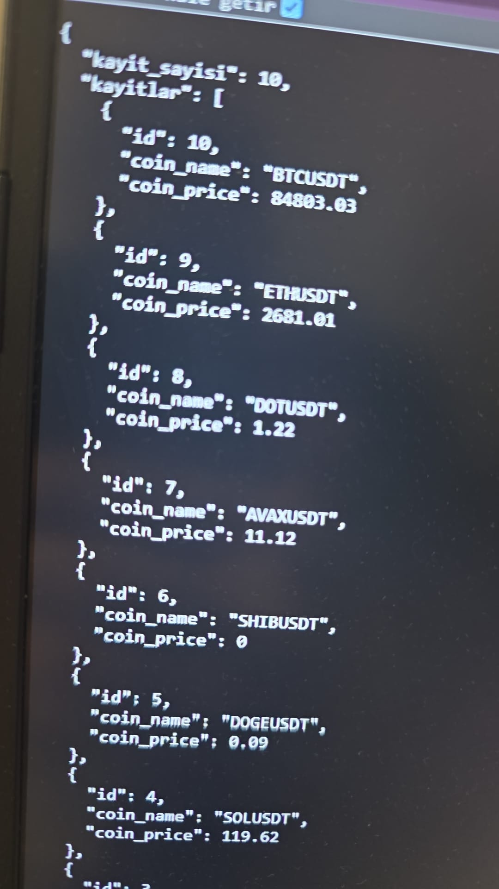
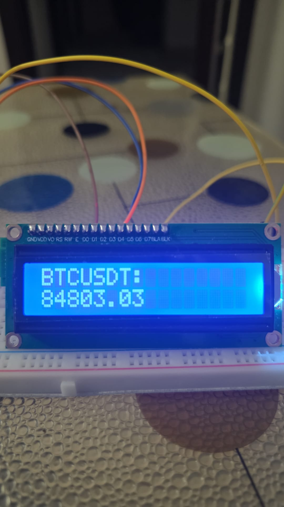
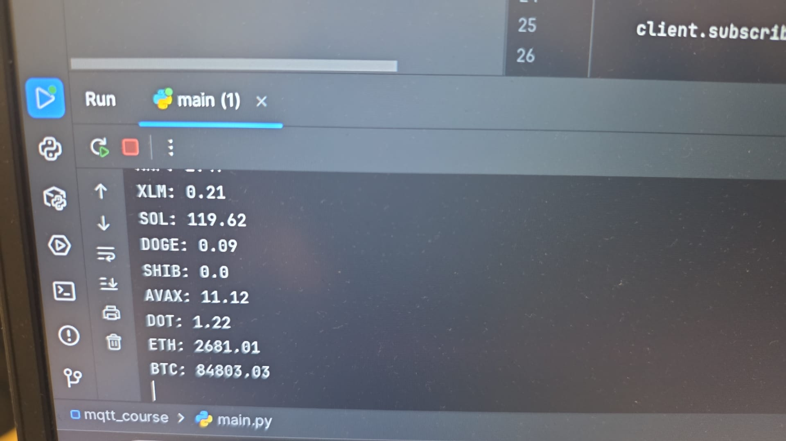
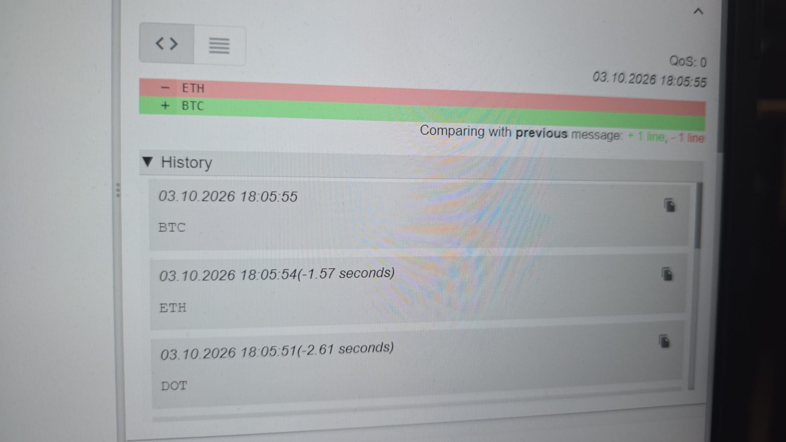
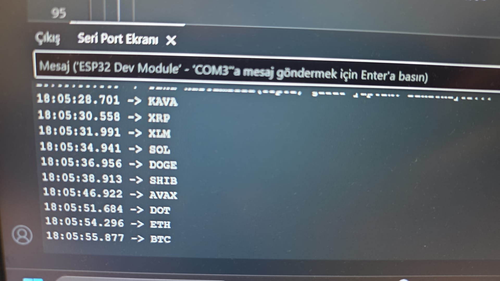

# ESP32 & MQTT Crypto Telemetry System

An end-to-end IoT crypto price telemetry system connecting an ESP32 hardware client with a Python backend service via MQTT.

<p align="center">
  
  
</p>
 |  | 

## Architecture

- **ESP32 Client (`firmware/`)**: Takes user input via Serial / keypad, publishes ticker requests over MQTT, and displays real-time price updates on an LCD display.
- **Python Gateway & API (`backend/`)**:
  - Listens to MQTT coin requests.
  - Fetches real-time market data via Binance Public API.
  - Persists telemetry logs into a SQLite database.
  - Serves historical and live data using FastAPI endpoints.

## Hardware Components

- ESP32 Development Board
- 16x2 I2C LCD Display
- USB-UART Interface / Serial Monitor

## Tech Stack

- **Firmware**: C++ / Arduino Framework (PubSubClient, LiquidCrystal_I2C, WiFi)
- **Backend**: Python 3.10+, FastAPI, Paho-MQTT, SQLite3, Requests
- **Protocol**: MQTT (Topic: `coin/name`, `coin/price`)

## Setup & Running

### 1. Backend Service
```bash
cd backend
pip install fastapi uvicorn paho-mqtt requests
python mqtt_gateway.py
